# OrcheStream.AI — System Architecture

A complete architectural design of OrcheStream.AI, a visual LLM agent builder / AI flow
orchestration platform. This document covers the runtime topology, every service, the flow
execution engine, the queue system, the sandboxed sidecar, data model, security model, and
the streaming contracts between components.

---

## Table of Contents

1. [High-Level Overview](#1-high-level-overview)
2. [Monorepo Structure & Workspace Contracts](#2-monorepo-structure--workspace-contracts)
3. [Runtime Topology (Docker Compose & Kubernetes)](#3-runtime-topology-docker-compose--kubernetes)
4. [Request Routing (nginx)](#4-request-routing-nginx)
5. [Frontend Architecture](#5-frontend-architecture)
6. [Backend (API) Architecture](#6-backend-api-architecture)
7. [The Flow Execution Engine](#7-the-flow-execution-engine)
8. [Queue, Jobs & Scheduling (Valkey + BullMQ)](#8-queue-jobs--scheduling-valkey--bullmq)
9. [The Sidecar — Sandboxed Code Execution](#9-the-sidecar--sandboxed-code-execution)
10. [LLM Provider Integration](#10-llm-provider-integration)
11. [Secrets, Env Vars & CyberArk](#11-secrets-env-vars--cyberark)
12. [Knowledge / RAG & Vector Stores](#12-knowledge--rag--vector-stores)
13. [SSE Event Contract & Streaming](#13-sse-event-contract--streaming)
14. [End-to-End Execution Flows](#14-end-to-end-execution-flows)
15. [Data Model](#15-data-model)
16. [Authentication, RBAC & Security Model](#16-authentication-rbac--security-model)
17. [Development & E2E Test Topology](#17-development--e2e-test-topology)
18. [Scaling & Operational Notes](#18-scaling--operational-notes)

---

## 1. High-Level Overview

OrcheStream.AI is a **visual, low-code platform for building and running AI agents as
directed acyclic graphs** ("flows"). Users drag nodes onto a canvas (LLM agents, MCP tools,
RAG retrievers, HTTP calls, conditionals, loops, human-in-the-loop approvals) and connect
them; the platform compiles the graph, executes it, streams every step back to the UI, and
persists full run history.

A flow can be triggered in **five ways**: manually (UI), by webhook (public API), by a cron
schedule, through an OpenAI-compatible chat API, or embedded as a subflow inside another
flow.

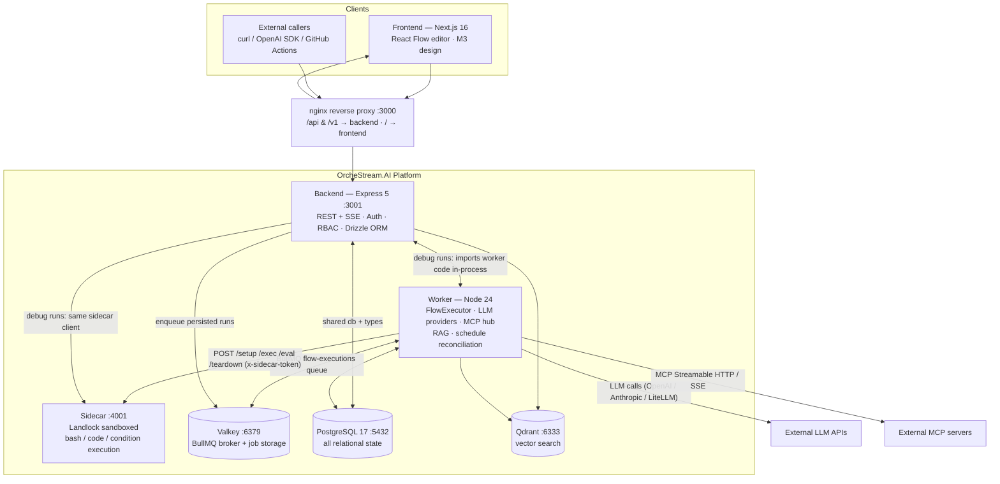

**Key architectural decisions at a glance:**

| Decision | Choice | Rationale |
|---|---|---|
| Execution engine sharing | Backend imports worker code at runtime | Debug runs, chat and OpenAI-compat paths execute **in-process** in the backend using the *exact same* `FlowExecutor` as persisted runs — behavior can never drift |
| Job queue | BullMQ on Valkey (Redis-compatible) | Crash-safe, distributed, supports delayed jobs (delay node), repeatable jobs (cron), retries with exponential backoff |
| Sandboxing | Dedicated sidecar service + Linux Landlock LSM | Untrusted bash/code/condition never runs in worker or backend process; no container-per-execution overhead |
| Storage | Single Postgres for everything (even vectors, as jsonb) | pgvector extension deliberately **not** installed; cosine similarity in plain SQL; Qdrant/Neo4j are optional pluggable mirrors |
| Streaming | SSE over fetch (no WebSockets, no EventSource) | Simple, proxies cleanly through nginx with buffering disabled |
| Scheduler | BullMQ repeatable jobs, no separate scheduler service | One less moving part; reconciliation loop fixes DB↔Redis drift |

---

## 2. Monorepo Structure & Workspace Contracts

npm workspaces monorepo (`package.json` root, `"type": "module"`, ESM everywhere):

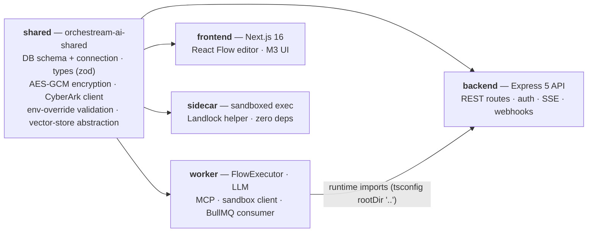

### Workspace responsibilities

| Workspace | Owns | Depends on |
|---|---|---|
| `shared` | **Single source of truth** for: all types (`shared/src/types/flow.ts` — the flow graph model, SSE events, execution model), DB schema (`shared/src/db/schema.ts`, ~35 tables), DB connection singleton, AES-256-GCM encryption, CyberArk/Conjur client, env-override parsing, vector-store registry (pgvector/Qdrant/Neo4j) | `drizzle-orm`, `pg`, `zod`, `@qdrant/js-client-rest`, `neo4j-driver` |
| `backend` | HTTP API: flows CRUD, executions, webhooks + OpenAPI, chat, auth (local + OIDC), admin, secrets, env vars, MCP servers, vector stores, knowledge | `shared`, **`worker`** (queue, engine, context, sandbox client, LLM, MCP hub) |
| `worker` | Flow execution engine, LLM providers, MCP client hub, RAG, sandbox client, BullMQ consumer + schedule reconciliation | `shared`, `bullmq`, `ioredis`, `openai`, `@anthropic-ai/sdk`, `@modelcontextprotocol/sdk`, `undici` |
| `frontend` | Next.js pages, React Flow editor, M3 component library, SSE parsing, Co-Pilot assistant | `shared`, `@xyflow/react`, Radix UI, Tailwind v4 |
| `sidecar` | Sandboxed execution server (pure Node built-ins) + `landlock-helper` static C binary | Node only (declares `shared` but never imports it) |

**Cross-workspace runtime imports** (backend importing worker) work because
`backend/tsconfig.json` includes `../shared/src` and `../worker/src` (rootDir `..`), and the
backend Dockerfile copies both workspaces into the image before compiling. The worker exposes
a library surface via `worker/src/index.ts`: `FlowExecutor`, `topologicalSort`, `callLLM`,
`MCPHub`, built-in tools, embeddings.

**Anti-drift rule:** `worker/src/executor/context.ts` and `worker/src/executor/runner.ts`
explicitly document that backend debug runs and worker persisted runs must share
`buildExecutionContext` and `FlowExecutor` so execution behavior is identical on both paths.

---

## 3. Runtime Topology (Docker Compose & Kubernetes)

### 3.1 Docker Compose (production-style deployment)

`docker-compose.yml` — 7 containers:

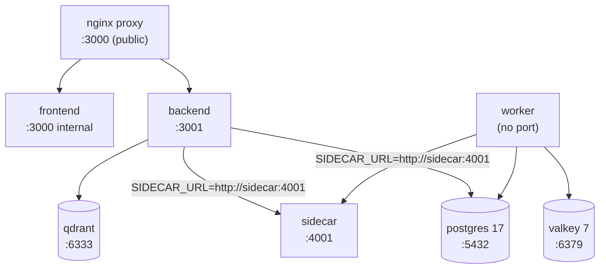

- **postgres / qdrant / valkey**: loopback-bound (`127.0.0.1`), digest-pinned images,
  named volumes. Valkey requires a password (`VALKEY_PASSWORD`).
- **sidecar**: shared by worker and backend, tmpfs `/var/flow-data` owned by UID 1001,
  only env var is `SIDECAR_TOKEN` (the auth token, not a workload secret).
- **backend/worker/frontend**: built from monorepo Dockerfiles, `cap_drop: ALL`,
  `init: true` (zombie reaping), non-root users.
- **proxy**: the single public ingress on :3000.

### 3.2 Helm / Kubernetes (production)

Single chart `helm/orchestream-ai/`. Key topology difference: **each pod that executes code
gets its own co-located sidecar container** (same pod, `localhost:4001`, shared `emptyDir`
`/var/flow-data`), instead of one shared sidecar service:

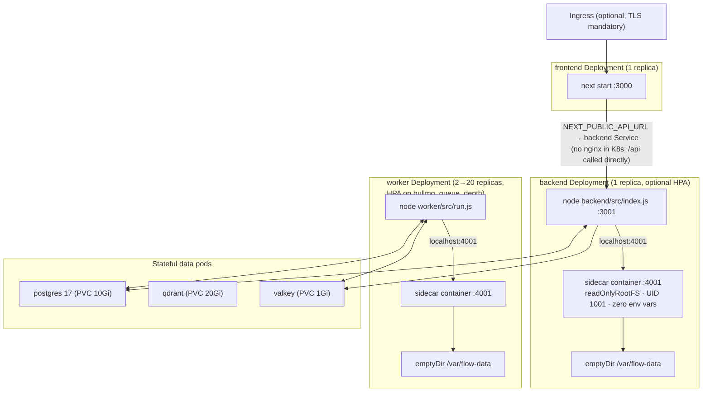

Notes:
- Backend runs DB migrations as an **init container** (`node backend/dist/db/migrate.js`).
- Worker autoscales on the external metric `bullmq_queue_depth` (target 10, 2→20 pods).
- The worker has no HTTP server — its liveness probe execs a fetch against the backend
  Service health endpoint.
- The sidecar container is the security boundary: `readOnlyRootFilesystem: true`,
  `runAsUser: 1001`, all capabilities dropped, CPU 200m / mem 256Mi limits. Landlock works
  **unprivileged** (no capabilities needed).
- Secrets come from a Secret (external `existingSecret` preferred, or auto-generated with
  stable `lookup`-backed random values for valkey-password and sidecar-token).
- `PDB` minAvailable 1 for backend/worker/frontend.

---

## 4. Request Routing (nginx)

`nginx/nginx.conf` — the single entry point (both compose and prod-style dev):

| Location | Upstream | Streaming behavior | Purpose |
|---|---|---|---|
| `/api/` | `backend:3001` | `proxy_buffering off`, read/send timeout **3600s**, `Connection ""`, chunked encoding on | All REST + **SSE** (execution streams must never be buffered) |
| `/v1/` | `backend:3001` | same streaming settings | OpenAI-compatible chat API (`/v1/chat/completions`) |
| `/` | `frontend:3000` | upgrade headers, 3600s read timeout | Next.js pages/assets (WebSocket/HMR support) |
| `/nginx-health` | — | `return 200 "ok"` | compose healthcheck |

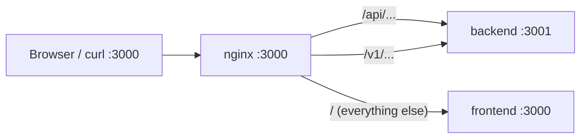

The frontend ships **no** API rewrite in production (nginx does the routing); in dev/e2e a
conditional Next.js rewrite (`BACKEND_URL` build-time env) or a dev nginx generated by
`scripts/dev.sh` handles it.

---

## 5. Frontend Architecture

- **Stack:** Next.js 16 pages router (no SSR — all client-side data fetching), React 19,
  TypeScript strict, Tailwind v4 with Material Design 3 tokens (light/dark themes via
  `.dark` class + localStorage persistence), `@xyflow/react` v12 canvas, Radix UI primitives,
  strict Material Symbols iconography.
- **State management:** none (no Redux/Zustand). The editor page owns `nodes`/`edges` in
  `useState` with manual undo/redo stacks (cap 50) and rAF-debounced canvas↔parent sync.

### Page map

| Route | Purpose |
|---|---|
| `/` | Dashboard: flows / subflows / agent-contexts tabs, search, pagination, trigger-type badges, Run/Edit/Delete |
| `/login` `/register` `/setup` `/profile` | Auth: sign-in, sign-up, first-run admin bootstrap, profile + password |
| `/flows/[id]/edit` | **The flow editor** (also `/flows/new/edit` for drafts with client-generated UUID) |
| `/flows/[id]/executions` | Run history for one flow, iteration-grouped step traces |
| `/executions/[id]` | Standalone execution detail with hierarchical `StepTree` |
| `/approvals` | HITL approval inbox (reader-role home), polls every 5s |
| `/chat/[flowId]` / `/chat/[flowId]/[sessionId]` | Chat sessions + SSE chat UI |
| `/settings/*` | Secrets, Env Vars, LLM Endpoints, MCP Servers, Knowledge (embedding providers + vector stores), Secret Vaults (CyberArk), Users, Groups, Global Context, Executions (approval admin), SSO |

### The flow editor

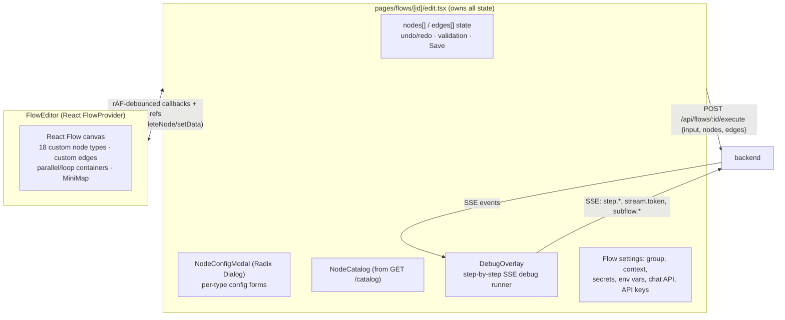

- **Node registry:** 18 node types (`trigger, llm-agent, mcp-tool, flow-tool, retriever,
  condition, switch, code, output, parallel, hitl, subflow, http, loop, delay, ai-action,
  map, note`) — driven by `GET /catalog` from the backend.
- **Connection rules:** `tool-input*` handles accept multiple incoming edges; everything
  else rejects a second incoming edge; `feedback-input` (HITL) edges are dashed amber and
  must originate from a HITL node.
- **Container nodes:** parallel and loop are dashed containers using React Flow `parentId`;
  children auto-layout and the container auto-resizes (`60 + children*170` px).
- **Config modal:** computes upstream node outputs (`getUpstreamNodeIds` + `getNodeFields`)
  to render an "Available Variables" tree — this is the `{{input.Label.field}}` template
  contract surfaced in the UI.
- **Debug runs execute the unsaved canvas** — nodes/edges are posted in the request body.
- **Co-Pilot** (AI assistant): a second agent surface. Global chat panel with page-aware
  system prompts, ~100 DOM/API tools in 9 groups, tool-call loop (max 5 rounds), per-page
  localStorage conversation memory.

### API client & streaming

`frontend/src/lib/api-client.ts`: thin fetch wrapper with `credentials: 'include'`
(cookie auth) + a `streamSSE()` async generator that POSTs and manually parses `data: `
SSE lines. No `EventSource` anywhere; all streaming (flow runs, chat, Co-Pilot) uses
`fetch` + `ReadableStream` + `AbortController`.

---

## 6. Backend (API) Architecture

- **Stack:** Express 5, helmet, cors (cookie-aware), cookie-parser, Drizzle ORM, pino
  logging. Port 3001. Async handlers wrapped in `asyncHandler` → errors forwarded to a
  global handler (500, message only in non-production).
- **Cross-cutting:** the backend **imports worker code at runtime** for:
  `FlowExecutor` (debug/chat/openai runs), `buildExecutionContext`, `enqueueExecution`
  (BullMQ), the sidecar sandbox client, `callLLM`, the MCP hub, and embedding generation.

### Route map (grouped)

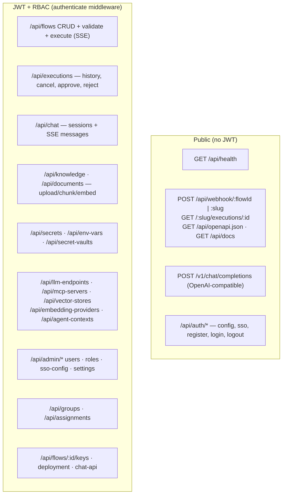

### The three execution paths the backend can run

| Path | Where it executes | Persistence |
|---|---|---|
| **Debug run** (`POST /api/flows/:id/execute`, `_debug: true`) | **In backend process** via `FlowExecutor.execute` with `onEvent` → SSE to the editor overlay; abort on socket close | None (temp id `debug_…`); HITL pauses kept in an in-memory map for resume |
| **Persisted run** (same endpoint, no `_debug`) | Fire-and-forget `enqueueExecution` → **worker process** via BullMQ | Full: executions + steps rows; SSE closes right after `execution.started` |
| **Chat / OpenAI-compat / Co-Pilot** | **In backend process** (per session) | Chat messages persisted; OpenAI-compat uses a transient session |

---

## 7. The Flow Execution Engine

The heart of the system: `worker/src/executor/engine.ts` (~2200 lines). A flow is
`{ id, name, nodes[], edges[], envVars, flowContext, groupId }` where nodes are
React-Flow-compatible (`{ id, type, position, data }`) and edges carry optional
`condition` branches. Stored as JSONB in Postgres; **the same engine runs in the backend
(in-process) and in the worker** — the worker adds a DB-persisting runner around it.

### 7.1 Compile → Sort → Execute pipeline

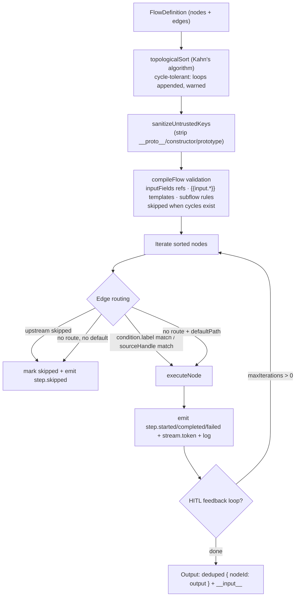

### 7.2 Node execution matrix

| Node | Execution behavior |
|---|---|
| `trigger` | Pass-through of accumulated input |
| `llm-agent` | Full tool-calling loop (see §10.4): prompt layering (global→group→flow→contexts→node), connected MCP/flow tools + auto-injected built-ins (`store_*`, `now`, `uuid`, `log`, `bash`), optional `structured_output` tool for JSON schema output, truncation/context-overflow recovery |
| `mcp-tool` | Connects via MCP hub, calls the tool; **only executes when an LLM agent calls it** (tool-input edges) |
| `retriever` | Embed query → `searchSimilar` on vector store → `{ query, chunks, context, count }`; tool-input style (LLM-driven) |
| `condition` | Expression evaluated **in the sidecar sandbox** (`/eval`), never in-process; matches output labels / defaultPath |
| `switch` | Dot-path field lookup → case index → edge routing |
| `code` | JS only; wrapped as IIFE and executed **in the sidecar** (`/exec`), stdout parsed as JSON |
| `parallel` | `Promise.all` over embedded `subNodes` with shared AbortController; sibling failure aborts the rest |
| `subflow` | Loads target flow (ancestry guard, depth ≤ 10), resolves `inputMapping` templates, merges subflow env vars, runs `SubFlowExecutor`, returns child output; `execution` rows link via `parent_execution_id` |
| `hitl` | First pass: throw `HitlPauseError` → execution becomes `awaiting_approval`, assignment row created, sandbox **kept alive**; on approval: replay from this node with `nodeId:__approved` in replay outputs |
| `output` | Streaming mode (upstream `.content`) / dot-path extraction / single label / full accumulation |
| `http` | SSRF-hardened fetch: DNS pre-validated (private IPs rejected unless `allowPrivate`), pinned lookup (no DNS-rebinding TOCTOU), manual redirect handling with re-validation, HMAC-SHA256 signing, auth types, 10 MB body cap, redirect cap 5 |
| `loop` | Iterates `itemsField` (cap 1000), synthetic sub-flow per item with `itemVariable`/`indexVariable`, shares abort signal |
| `delay` | `fixed` / ISO-8601 `duration` / `timestamp` + jitter → throws `PauseExecutionError` → **delayed BullMQ job** re-enqueued with replay metadata (crash-safe, not `setTimeout`) |
| `ai-action` | Single-shot LLM call (no tools, no context layering) |
| `map` | Dot-path field extraction, `replace` or `merge` mode |
| `note` | Annotation only, no execution |

### 7.3 Template resolution (`{{…}}`)

`resolveTemplate` / `resolveTemplateSync` (engine.ts:2061+):
- `{{input.Label.field}}` — dot paths, array-bracket access (`items[0]`), slugified-label
  fallback; objects are JSON-stringified; unresolved → warning + empty string.
- `{{secrets.core.(flow:|group:|app:)name}}` — scope-aware AES-GCM secrets.
- `{{env.VAR}}` — from the execution's resolved `sandboxEnv`.
- `{{secrets.cyberark.PATH}}` — **live** CyberArk Conjur query at run time.

### 7.4 Persisted runner (`worker/src/executor/runner.ts`)

Wraps the engine with persistence: inserts/updates `executions` + `execution_steps` rows
(iteration/hierarchy-aware upserts, closes stale `running` rows on restart), handles
HITL (`awaiting_approval` + assignment mirroring), delay resume (re-enqueue with
`__replayFrom`/`__replayOutputs`), strips `__env`/replay metadata from engine input, runs
sandbox setup/teardown per execution, and maps error types to execution statuses.

---

## 8. Queue, Jobs & Scheduling (Valkey + BullMQ)

### 8.1 Queue topology

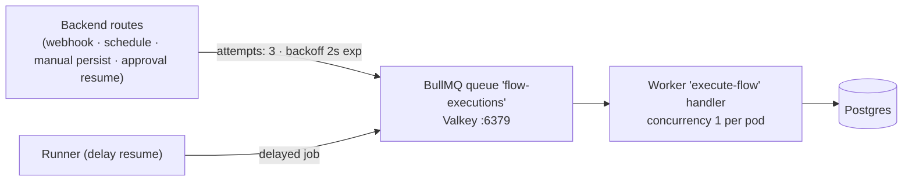

| Entity | Details |
|---|---|
| Queue name | `flow-executions` |
| Job name | `execute-flow` |
| Payload | `{ flow?: FlowDefinition, input?, flowId?, inputMessage?, envOverrides? }` |
| Retries | 3 attempts, exponential backoff 2 s (set on every enqueue) |
| Dead-letter | None — exhausted jobs remain in the failed set |
| Concurrency | BullMQ default (1) per worker process; horizontal scale via worker replicas |

### 8.2 Job lifecycle state machine

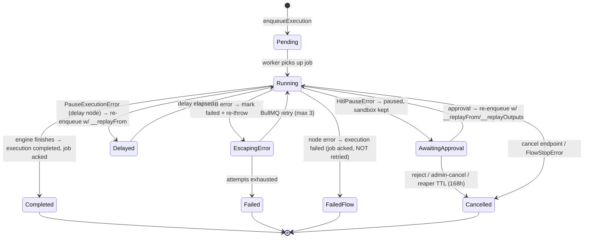

### 8.3 Scheduling (cron)

- A flow with a `schedule` trigger registers a **BullMQ Job Scheduler** named
  `schedule:<flowId>` (`repeat: { pattern: cron }`, stable `jobId` for idempotency) — done
  by flow create/update/delete routes.
- A **reconciliation worker** (`worker/src/schedule-reconciliation.ts`) runs at boot and
  hourly: lists DB flows and BullMQ schedulers, upserts/removes to fix drift (e.g. after
  Redis data loss).
- Schedule job payloads are `{ flowId, inputMessage }` — the worker loads the latest flow
  definition from DB at trigger time (repeatable jobs don't carry flow snapshots).

### 8.4 HITL reaper

`worker/src/sandbox/reaper.ts` — hourly scan of `awaiting_approval` executions older than
`SIDECAR_TTL_HOURS` (default 168 h = 7 days): marks them cancelled (`'HITL TTL expired'`)
and tears down their sandbox.

---

## 9. The Sidecar — Sandboxed Code Execution

The security-critical component. Previously, `code` nodes and bash tools ran
`new Function(...)` **in the worker process** — an RCE hole. The sidecar closes it.

- **Service:** single-file Node HTTP server (`sidecar/src/index.ts`, 451 lines), port 4001,
  zero runtime deps, non-root (UID 1001), read-only rootfs, all capabilities dropped.
- **Isolation:** not a VM, not per-execution containers — one long-lived server that spawns
  one OS process per command, each confined by the **Linux Landlock LSM** via a static C
  helper (`sidecar/cmd/landlock-helper/main.c`, compiled `-Os -static` with musl):

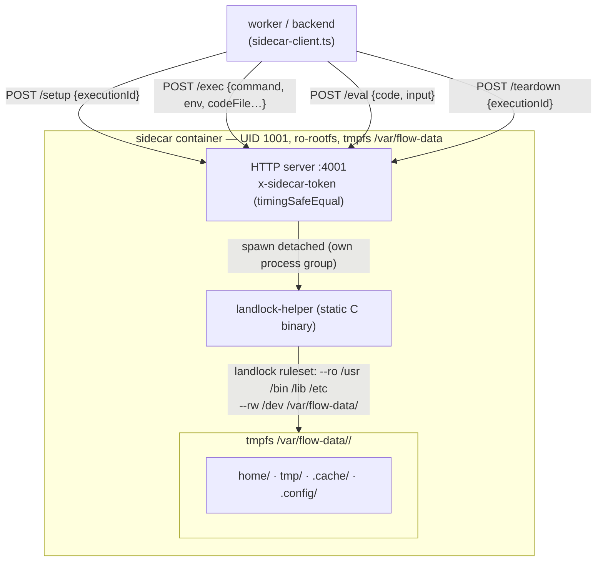

### The Landlock rule set

```
--ro /usr  --ro /bin  --ro /lib  --ro /etc    # read-only + executable (node, python, git, CA certs…)
--rw /dev                                     # git needs /dev/null
--rw /var/flow-data/<executionId>             # the only writable area
-- bash -c <command>
```

`landlock-helper` probes the ABI, creates a ruleset covering **all** FS access rights
(including `REFER` and `TRUNCATE` on newer ABIs), sets `PR_SET_NO_NEW_PRIVS`, then
`restrict_self` — the restriction is inherited by the whole process tree. **Fail-closed:**
if Landlock is unavailable the sidecar returns 500; there is no insecure fallback.

### API surface

| Endpoint | Purpose |
|---|---|
| `POST /setup` | Create per-execution dirs (`home/tmp/.cache/.config`) + `.gitconfig`; idempotent (safe for HITL resume) |
| `POST /exec` | Run a command (or a written `codeFile`): sanitized env, SSH key injection (`SSH_PRIVATE_KEY` → pinned `id_rsa` + `GIT_SSH_COMMAND`), timeout → SIGKILL process group, 1 MB stdout/stderr caps (stderr overflow kills) |
| `POST /eval` | Condition expressions wrapped as `(function(input){…})(input)`, 15 s timeout, `__COND_ERR__` protocol, no request env (conditions can't read secrets) |
| `POST /teardown` | `rm -rf` the execution dir |

Path-traversal defenses: `executionId` must match `^[a-zA-Z0-9_-]+$`, `workdir` must resolve
inside the sandbox dir, `codeFileName` must be a plain filename. Env sanitization on both
worker and sidecar layers; `HOME`/`TMPDIR`/`GIT_CONFIG_GLOBAL` force-set into the sandbox.

**Lifecycle:** setup on run start → persists across all tool calls within the run (files in
`$HOME` = agent memory) → teardown on completion/failure/cancel → skipped while HITL-paused
→ dual reapers (DB reaper in worker + filesystem reaper in sidecar, both 168 h TTL) as
safety nets.

**Egress is deliberately NOT blocked** (git clone, npm install, curl are core use cases).
The threat model is filesystem confinement + secret hygiene, not network isolation.

---

## 10. LLM Provider Integration

### 10.1 Provider adapters (`worker/src/providers/`)

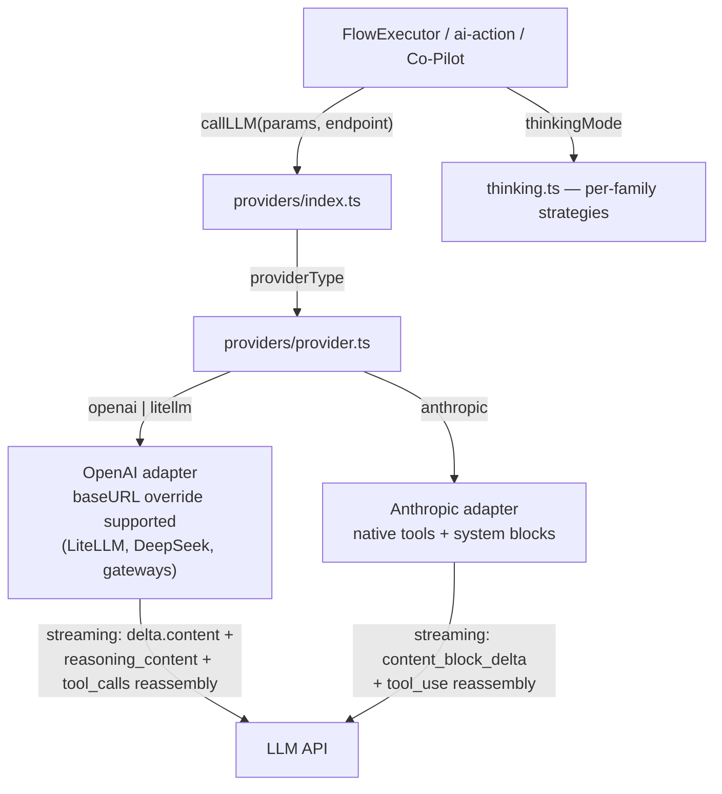

- Endpoints are DB rows (`llmEndpoints`) with `providerType: anthropic | openai | litellm`,
  group-scoped. Resolved per run via the execution context.
- `LLM_MAX_TOKENS` default 32000; `LLM_CALL_TIMEOUT_MS` default 120 s; SDK `maxRetries: 1`.
- **Thinking modes** (`shared/src/types/thinking.ts`): normalized
  `default|disabled|enabled|low|medium|high|xhigh|max` mapped per family:
  - OpenAI: `reasoning_effort` (low/medium/high)
  - Anthropic: `reasoning: { effort: none|low|high|max }`
  - DeepSeek (detected by base URL/model): `thinking: { type }` + `reasoning_effort`;
    **must echo `reasoning_content` back** on assistant tool messages or the API 400s.

### 10.2 LLM Agent tool loop

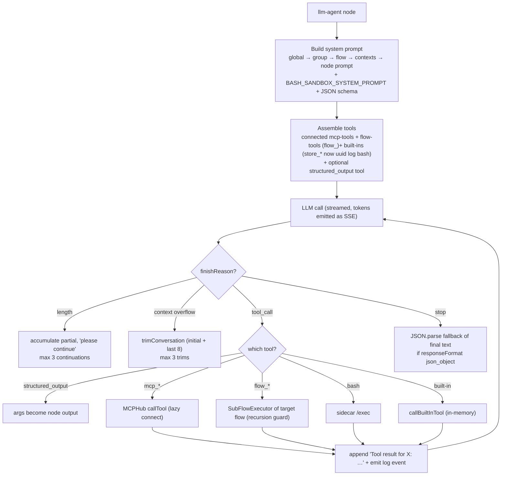

Guardrails: progress check every 5 rounds; 2 consecutive LLM failures fail the node;
prompt-only contract (the LLM receives only the system prompt — no user message is derived
from flow input; `'Proceed.'` placeholder for Anthropic's alternating-turn requirement).

---

## 11. Secrets, Env Vars & CyberArk

### 11.1 Core secrets (AES-256-GCM envelope encryption)

- `SECRETS_ENCRYPTION_KEY` (64 hex chars) is the key-encryption-key (KEK). Production
  refuses to boot with the known dev default. Fails fast.
- Per-secret random IV + GCM auth tag; data-encryption-keys (DEKs) versioned in
  `encryption_key_versions`; `secrets` rows store ciphertext + IV + tag + `key_version`.
- **Key rotation:** generate new DEK + wrap with KEK, deactivate old, then
  `re-encrypt-all` migrates every secret. Audit log for reveals (rate-limited 10/5 min).

**Scopes:** `app` (global) → `group` (per group) → `flow` (per flow). Lookups resolve
flow-scoped first, then group, then app — **each filtered by `scope_id`** so a flow can only
see secrets in its own scope chain.

### 11.2 Env vars (three layers + per-run overrides)

| Layer | Where | Types |
|---|---|---|
| App | `app_env_vars` table (admin) | `static` \| `core_secret` \| `cyberark` |
| Group | `app_env_vars.group_id` (group admin) | same |
| Flow | `flows.env_vars` JSONB (in flow settings) | same |
| **Per-run override** | `envOverrides` on run request / webhook | `string` \| `{type:'core_secret'\|'cyberark', value}` |

Per-run overrides (the newest feature):
1. Validated by shared `parseEnvOverrides`.
2. **Allowlisted against `flows.env_vars`** — you can only override names the flow already
   declares (arbitrary env injection is impossible).
3. Persisted as `__envOverrides` on the execution row (references only, never resolved
   plaintext) and threaded through `enqueueExecution → run.ts → runner → buildExecutionContext`.
4. Preserved across delay resumes; stripped from engine input before execution.
5. `core_secret` refs resolve flow→group→app with `scope_id` filtering + audit logging.

### 11.3 CyberArk (Conjur) live vault

- Vault connections (`secretVaults` table): URL, account, login, encrypted API key,
  self-hosted toggle, CA cert, group binding (`groupVaultConfig` — one vault per group).
- Live queries at run time: `{{secrets.cyberark.PATH}}` → Conjur `GET /secrets/{account}/variable/{path}`.
- Token cache 8 min TTL, 401 → clear + single retry, 10 s timeouts.

### 11.4 Sandbox env hygiene

Worker-side `sanitizeEnvVars` drops `DATABASE_URL`, `*SECRET*`, `*API_KEY*`, `*PASSWORD*`,
`*TOKEN*`, `JWT_SECRET`, `VALKEY*`, `REDIS*`, `QDRANT*`, `NODE_ENV` etc.; sidecar
re-sanitizes with an allowlist + name-pattern check; client-supplied `__env` is stripped at
the API boundary. The sidecar container itself holds **zero** workload env vars.

---

## 12. Knowledge / RAG & Vector Stores

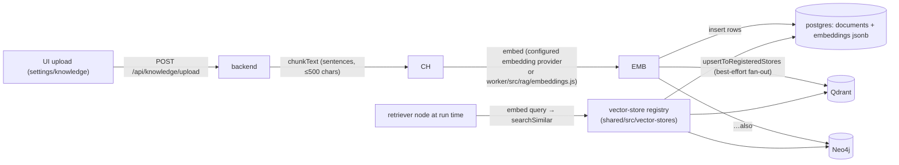

- **Built-in store:** `pgvector` — but pgvector the *extension* is **not installed**;
  vectors are jsonb arrays and cosine similarity is computed in plain SQL. Zero/all-zero
  vectors score 0.
- **External stores:** Qdrant (collection auto-created, Cosine distance) and Neo4j
  (`gds.similarity.cosine`), both pluggable behind the `VectorStore` interface.
- **Registry is in-memory and must be initialized in every process that executes flows**
  (`initVectorStores(db)` runs in backend + worker boot) or retriever nodes in
  worker-executed runs search an empty registry.
- Uploads mirror to every registered external store; failures are logged, never fatal.

---

## 13. SSE Event Contract & Streaming

**Event types** (`shared/src/types/flow.ts:369-392`): `execution.started/completed/failed/
paused/stopped`, `step.started/completed/failed/skipped`, `stream.token`, `subflow.started/
completed/failed`, `log`. Frame shape:
`data: {"type","executionId","nodeId?","data","timestamp","hierarchy?{path,depth}"}\n\n`.

All SSE is **fetch-based** (no EventSource); nginx has buffering disabled for `/api` and
`/v1`. HTTP-level details: `Content-Type: text/event-stream`, `Cache-Control: no-cache`,
`Connection: keep-alive`, `X-Accel-Buffering: no`, flushHeaders, socket-close guards.

| Consumer | Endpoint | Consumes |
|---|---|---|
| DebugOverlay | `POST /api/flows/:id/execute` (debug) | full step/token/subflow stream, HITL pause + inline approve |
| Editor handleRun | same | `execution.completed/failed` |
| Dashboard Run button | same | just the first event (confirms start), then cancels — fire-and-forget |
| Chat UI | `POST /api/chat/sessions/:id/messages` | `tool_call`, `tool_result`, `done`, `error` |
| Co-Pilot | `POST /api/llm/chat` | `token`, `tool_call`, `error` |
| OpenAI-compatible consumers | `POST /v1/chat/completions` (`stream: true`) | `chat.completion.chunk` frames + `data: [DONE]` |

Persisted runs emit only `execution.started` on the SSE stream (fire-and-forget); history
is read back from the DB.

---

## 14. End-to-End Execution Flows

### 14.1 Manual run (dashboard / editor)

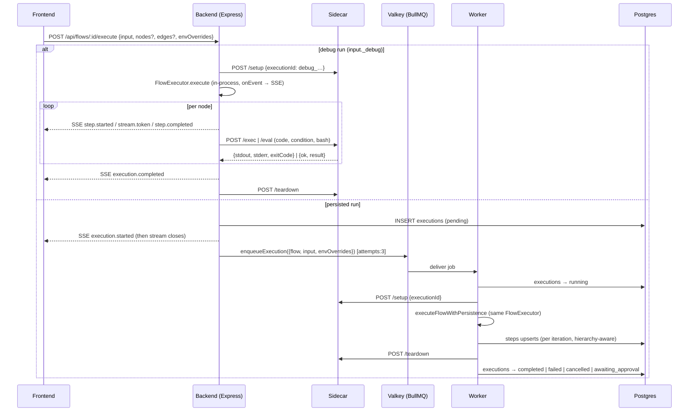

### 14.2 Webhook execution

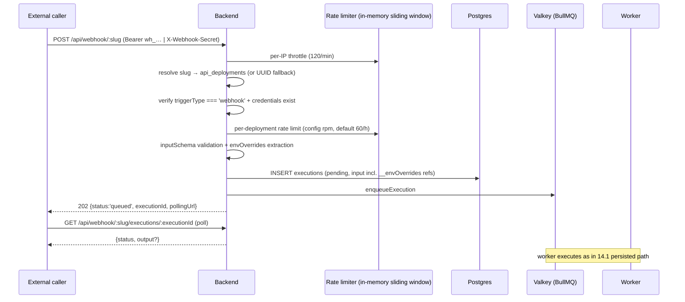

Auto-generated **OpenAPI 3.0.3 spec** (`GET /api/openapi.json`) from `api_deployments`
(never secrets), Swagger UI at `/api/docs`.

### 14.3 Chat / OpenAI-compatible

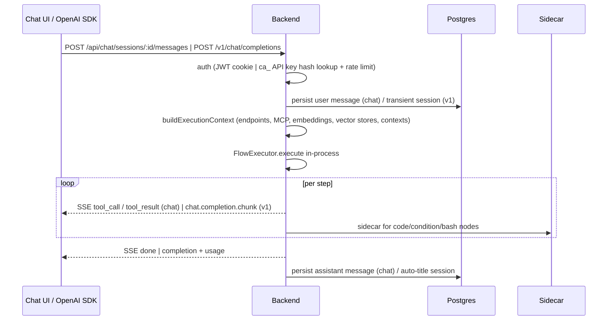

### 14.4 HITL pause/resume (persisted run)

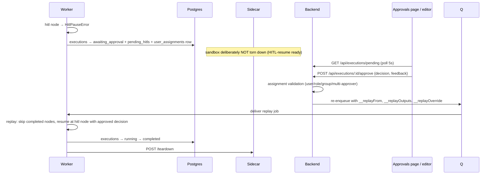

### 14.5 Scheduled runs

Flow with `schedule` trigger → BullMQ Job Scheduler `schedule:<flowId>` (cron) →
worker receives `{flowId, inputMessage}` → loads latest flow from DB → merges
`{triggerType:'schedule', timestamp}` into input → runs persisted pipeline.
Hourly reconciliation keeps DB cron and BullMQ schedulers in sync.

---

## 15. Data Model

~35 tables in `shared/src/db/schema.ts`, Drizzle ORM, PostgreSQL, JSONB for graph + vectors:

```mermaid
erDiagram
    users ||--o{ groups : "group_members"
    users ||--o{ flows : "created_by"
    groups ||--o{ flows : "group_id"
    groups ||--o{ users : "membership"
    flows ||--o{ flow_versions : "snapshots"
    flows ||--o{ executions : "runs"
    flows ||--o{ api_deployments : "webhook slug"
    flows ||--o{ api_keys : "wh_ personal keys (SHA-256 hash)"
    flows ||--o{ chat_api_deployments : "OpenAI-compatible"
    flows ||--o{ chat_api_keys : "ca_ keys"
    executions ||--o{ execution_steps : "per-node traces"
    executions ||--o{ executions : "parent_execution_id (subflows)"
    executions ||--o{ user_assignments : "HITL"
    users ||--o{ user_assignments : "assigned"
    groups ||--o{ secret_vaults : "groupVaultConfig"
    secrets ||--o| users : "created_by"
    groups ||--o{ secrets : "scope=group"
    flows ||--o{ secrets : "scope=flow"
    llm_endpoints ||--o{ groups : "group_id (nullable = app-wide)"
    mcp_servers ||--o{ groups : "group_id"
    embedding_providers ||--o{ groups : "group_id"
    vector_stores ||--o{ groups : "group_id"
    documents ||--o{ embeddings : "chunks"
    chat_sessions ||--o{ chat_messages : "messages"
    agent_contexts ||--o{ groups : "group_id"
    users ||--o{ roles : "RBAC permission strings"
    sso_config ||--|| users : "single row (id=1)"

    users {
        uuid id PK
        text email
        text password_hash "bcrypt(10)"
        text[] permissions "from role"
        text provider "local | sso"
        text oidc_refresh_token
    }
    flows {
        uuid id PK
        jsonb nodes "React Flow graph"
        jsonb edges
        jsonb env_vars "static|core_secret|cyberark"
        text flow_context
        boolean is_subflow
        uuid group_id FK
    }
    executions {
        uuid id PK
        execution_status status "pending|running|completed|failed|cancelled|awaiting_approval"
        jsonb input
        jsonb output "incl. _flowSnapshot for HITL replay"
        uuid parent_execution_id FK
        jsonb pending_hitls
    }
    secrets {
        uuid id PK
        text scope "app|group|flow"
        uuid scope_id
        text secret_type "core|cyberark"
        text ciphertext "AES-256-GCM"
        text iv, tag, key_version
    }
    api_keys {
        uuid id PK
        text key_hash "SHA-256, prefix stored"
    }
```

Enums: `execution_status`, `execution_step_status`, `provider_type`, `message_role`.
Subflow hierarchy: `parent_execution_id` self-FK + `subflowNodeId`/`subflowDepth`.
Executions carry a `_flowSnapshot` in `output` so HITL replay is faithful to the original
graph. Secrets store AES-GCM ciphertext + IV + tag + key version.

---

## 16. Authentication, RBAC & Security Model

### 16.1 Three auth layers

| Layer | Mechanism | Where |
|---|---|---|
| **UI sessions** | JWT in httpOnly cookie (`token`, 7 d, sameSite=lax) or Bearer header; payload `{userId, email, role, permissions, groups}` | All `/api/*` except public routes |
| **OIDC / SSO** | openid-client; authorization-code flow with state/nonce cookies; userinfo merge; group claims (incl. Keycloak `realm_access.roles`); role mapped from admin/editor group mapping; token refresh near expiry on `/auth/me`; group re-sync | `sso_config` single row; SSO-provisioned groups locked from editing |
| **API keys** | Webhook: personal `wh_` keys (SHA-256 hash lookup, one per user per flow, `last_used_at` touch) or trigger-node webhook secret (`X-Webhook-Secret`, timing-safe compare). Chat API: `ca_` keys (hash, enabled, expiry, deployment, rate limit). Raw keys shown **once**. | `api_keys`, `chat_api_keys` |

Rate limiting: login 10/15min per IP+username, register 5/h per IP, SSO 10/15min
(express-rate-limit, **enforced only in production**); webhook per-IP 120/min + per-deployment
RPM (in-memory sliding window — per-process, documented limitation).

### 16.2 RBAC

Roles: `admin`, `editor`, `reader`, `group_admin`. Fine-grained permission strings
(`flow:*`, `endpoint:*`, `mcp:*`, `secrets:*`, `execution:approve`, `groups:manage`,
`vaults:*` …) checked by `requirePermission` middleware; `admin` bypasses. Group scoping
enforced per-route (`canAccessFlow`/`canManageFlow`, group-scoped lookups in the execution
context). First registered user becomes admin; default roles seeded on first register.

### 16.3 Security hardening highlights

- Production refuses known-default/weak `JWT_SECRET` (<32 chars) and dev encryption key.
- Webhook endpoints with no configured credentials are **never publicly triggerable** (401).
- SSRF-hardened HTTP node with DNS pinning (no rebinding TOCTOU).
- Untrusted input sanitization (prototype-pollution strip) before any merge.
- Sidecar: Landlock, token auth, zero secrets, fail-closed, path traversal defense,
  env allowlist/blocklist, log redaction, process-group SIGKILL on timeout.
- Secrets: AES-GCM envelope encryption, key rotation, reveal rate limit + audit log,
  scope_id-filtered resolution, raw values never persist in run history.
- Helmet, 10 MB JSON body cap, body-type guard (no arrays/primitive bodies), UUID param
  validation, `cap_drop: ALL` + non-root everywhere, digest-pinned images.

---

## 17. Development & E2E Test Topology

### 17.1 Local dev (`npm run dev`)

Hybrid: **infrastructure in Docker, app processes on host**.

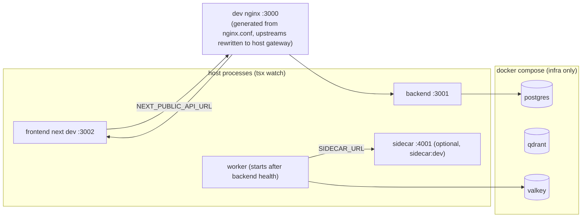

`scripts/dev.sh`: starts infra containers → `drizzle-kit push` → generates dev nginx config
(sed-rewrites upstreams to `$GATEWAY` host ports) → `concurrently` runs backend, worker
(wait-on health), frontend. `dev-down.sh` kills tsx/next and removes the nginx container.

### 17.2 E2E (Playwright, 441 tests / 33+ spec files)

- **Sequential mode:** `docker-compose.e2e.yml` — full 13-service stack (postgres/qdrant/
  valkey on tmpfs, backend/frontend/worker/sidecar with `Dockerfile.e2e` tsx variants, plus
  **mock servers**: `mock-llm` (OpenAI-compatible), `mock-mcp`, `mock-oidc` (SSO), 
  `mock-cyberark` (Conjur)) — everything ephemeral.
- **Parallel mode (`test/run-e2e-parallel.sh`, ~2 min):** 4 isolated stacks with
  parameterized ports, spec groups balanced by measured duration; stack 1 keeps default
  ports for port-sensitive specs (SSO, openai-chat). Each stack runs
  `00-initial-setup.spec.ts` (register+login) then its balanced group with
  `--project=authenticated --workers=1`.

---

## 18. Scaling & Operational Notes

| Concern | Current design | Notes |
|---|---|---|
| Worker throughput | Horizontal: multiple worker pods consuming the same BullMQ queue | HPA on `bullmq_queue_depth` (2→20); concurrency 1 per process keeps ordering simple |
| Webhook rate limiting | In-memory per process | Not accurate across replicas — a documented limitation (would need Redis-backed limiter) |
| Execution idempotency | `__executionId` carried in job payload; executions row upserted by worker | Failed infra jobs retried 3× by BullMQ; flow-level failures are NOT retried (they're deterministic bugs) |
| Sandbox capacity | One sidecar per pod (K8s) or shared sidecar (compose) | Sidecar is the bottleneck for CPU-bound bash/code; container-wide CPU/mem limits, no per-command cgroups |
| SSE fan-out | 1:1 (caller ↔ backend) | No pub/sub fan-out needed since runs are initiated by the viewer |
| Scheduler resilience | BullMQ repeatable jobs + hourly reconciliation | Drift heals automatically; scheduler jobs load latest flow from DB |
| HITL durability | `_flowSnapshot` in execution output + replay machinery | Approvals days later replay the exact original graph |
| Storage growth | Steps/executions accumulate | No retention policy yet; executions with `output._pausedTotal` aid duration metrics |

---

## Appendix — Key Source Files

| Concern | Location |
|---|---|
| Flow graph model, SSE events, execution types | `shared/src/types/flow.ts` |
| DB schema (~35 tables) | `shared/src/db/schema.ts` |
| Encryption, CyberArk, env-overrides, vector stores | `shared/src/utils/`, `shared/src/vector-stores/` |
| Server boot + middleware + router mounting | `backend/src/index.ts` |
| Execution routes (debug/persisted/approvals) | `backend/src/routes/execution.ts` |
| Webhook + OpenAPI | `backend/src/routes/webhook.ts`, `webhook-openapi.ts`, `webhook-security.ts` |
| Auth (JWT, SSO, register/login) | `backend/src/routes/auth.ts`, `backend/src/middleware/auth.ts` |
| Queue + enqueue | `worker/src/queue.ts` |
| Worker boot / consumer | `worker/src/run.ts` |
| Persisted runner | `worker/src/executor/runner.ts` |
| Flow execution engine (node handlers) | `worker/src/executor/engine.ts` |
| Execution context (endpoints/secrets/env/cyberark) | `worker/src/executor/context.ts` |
| LLM providers + thinking modes | `worker/src/providers/` |
| Sandbox client + manager + reaper | `worker/src/sandbox/` |
| Sidecar server + Landlock helper | `sidecar/src/index.ts`, `sidecar/cmd/landlock-helper/main.c` |
| Flow editor canvas + node config | `frontend/src/components/flow/` |
| Editor page | `frontend/pages/flows/[id]/edit.tsx` |
| API client + SSE parser | `frontend/src/lib/api-client.ts` |
| Proxy config | `nginx/nginx.conf` |
| K8s manifests | `helm/orchestream-ai/` |
| Sandbox design rationale | `docs/sandboxed-tool-execution.md` |
